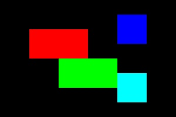

# 🎯 K-means C++ Pipeline

[](https://en.cppreference.com/w/cpp/17)
[](https://opencv.org/)
[](https://cmake.org/)
[](LICENSE)

Une suite complète d'outils K-means en C++17 avec visualisations interactives, compression d'images et architecture modulaire.

## 🚀 Fonctionnalités

- 🎨 **Visualisation 2D interactive** : Animation temps-réel de la convergence K-means
- 🖼️ **Compression d'images** : Réduction de palettes couleur intelligente
- 🔧 **Architecture modulaire** : Bibliothèque header-only réutilisable
- 📊 **Support multi-formats** : JPEG, PNG, BMP, CSV
- ⚡ **Performance optimisée** : C++17 avec templates et STL moderne

## 🎬 Démo

### Visualisation 2D Interactive

*Convergence K-means sur 8 clusters avec 735 points*

### Compression d'Images
| Original | Compressé (16 couleurs) |
|----------|-------------------------|
|  |  |

## 🛠️ Installation

### Prérequis
- **C++17** compatible compiler (GCC 7+, Clang 5+, MSVC 2019+)
- **CMake 3.15+**
- **OpenCV 4.0+** (pour visualisation et images)

### Ubuntu/Debian
```bash
sudo apt update
sudo apt install cmake g++ libopencv-dev
```

### Build
```bash
git clone https://github.com/votre-username/kmeans-cpp-pipeline.git
cd kmeans-cpp-pipeline
mkdir build && cd build
cmake .. -DCMAKE_BUILD_TYPE=Release
make -j$(nproc)
```

## 🎮 Utilisation

### 1. Visualisation 2D Interactive
```bash
./kmeans_visual_2d [K=8] [iterations=15] [fichier.csv]

# Exemples
./kmeans_visual_2d                    # 8 clusters par défaut
./kmeans_visual_2d 5 20              # 5 clusters, 20 itérations
./kmeans_visual_2d 3 10 data.csv     # Depuis fichier CSV
```

**Contrôles** :
- `ESC` : Quitter
- `SPACE` : Pause/Reprendre

### 2. Compression d'Images
```bash
./kmeans_image input.jpg output.jpg [K=16] [iterations=50]

# Exemples
./kmeans_image photo.jpg compressed.jpg          # 16 couleurs
./kmeans_image photo.jpg art.jpg 8 100          # Style artistique
```

### 3. Comparaison Visuelle
```bash
./view_side_by_side original.jpg compressed.jpg "Avant | Après"
```

### 4. Version Refactorisée (Recommandée)
```bash
./kmeans_simple                                   # Clustering basique
./kmeans_image_refactored input.jpg output.jpg   # Version optimisée
```

## 📁 Architecture

```
kmeans-cpp-pipeline/
├── src/
│   ├── kmeans_lib.hpp           # 🏗️ Bibliothèque header-only
│   ├── kmeans_visual_2d.cpp     # 🎨 Visualiseur interactif 2D
│   ├── kmeans_image.cpp         # 🖼️ Compression d'images
│   ├── view_side_by_side.cpp    # 👀 Comparateur visuel
│   ├── kmeans_simple.cpp        # ⚡ Version refactorisée basique
│   └── kmeans_image_refactored.cpp # ⚡ Version refactorisée images
├── CMakeLists.txt               # 🔧 Configuration build
├── README.md                    # 📖 Documentation
└── docs/                        # 📚 Documentation détaillée
```

## 🧮 Algorithme K-means

L'implémentation suit l'algorithme de Lloyd :

```cpp
1. Initialisation aléatoire des K centroïdes
2. Pour chaque itération :
   a. Assignation : Chaque point → centroïde le plus proche
   b. Mise à jour : Recalcul des centroïdes (moyennes)
   c. Convergence : Arrêt si plus de changement
```

**Complexité** : O(n × k × i × d)
- n : nombre de points
- k : nombre de clusters  
- i : nombre d'itérations
- d : dimensions

## 🎓 Aspect Pédagogique

Le code est entièrement documenté dans un style éducatif :

```cpp
/**
 * Calcule la distance euclidienne entre deux points
 * 
 * FORMULE MATHÉMATIQUE:
 * distance(A,B) = √[(x₂-x₁)² + (y₂-y₁)²]
 * 
 * POURQUOI EUCLIDIENNE?
 * - Distance "naturelle" dans l'espace 2D/3D
 * - Préserve les relations géométriques
 * - Optimale pour clusters sphériques
 */
double distance(const Vector2D& a, const Vector2D& b);
```

## ⚡ Performance

| Outil | Points | Clusters | Temps moyen |
|-------|--------|----------|-------------|
| Visual 2D | 735 | 8 | 15 itérations × 1.8s |
| Image (640×480) | 307,200 | 16 | ~2.3s |
| Simple | 1000 | 10 | ~0.1s |

## 🔄 Options de Build

```bash
cmake .. \
  -DBUILD_TOY=ON \           # Exemple basique
  -DBUILD_IMAGE=ON \         # Outils images
  -DBUILD_VIEWER=ON \        # Visualiseur
  -DBUILD_VIS2D=ON \         # Animation 2D
  -DBUILD_REFACTORED=ON      # Versions optimisées
```

## 🐛 Résolution de Problèmes

### OpenCV non trouvé
```bash
# Ubuntu
sudo apt install libopencv-dev

# Arch Linux  
sudo pacman -S opencv

# macOS
brew install opencv
```

### Erreur de compilation C++17
```bash
cmake .. -DCMAKE_CXX_STANDARD=17
```

## 🤝 Contribution

1. Fork le projet
2. Créer une branche feature (`git checkout -b feature/amazing-feature`)
3. Commit vos changements (`git commit -m 'Add amazing feature'`)
4. Push vers la branche (`git push origin feature/amazing-feature`)
5. Ouvrir une Pull Request

## 📊 Statistiques Projet

- **Lignes de code** : 1,108
- **Modules** : 8 outils spécialisés
- **Architecture** : Header-only library pattern
- **Documentation** : 200+ commentaires explicatifs

## 📜 License

Ce projet est sous licence MIT - voir le fichier [LICENSE](LICENSE) pour plus de détails.

## 🏆 Acknowledgments

- Algorithme K-means de Stuart Lloyd (1957)
- OpenCV team pour l'excellente bibliothèque vision
- C++ Standards Committee pour C++17

---

⭐ **Star ce projet si il vous a été utile !**

📧 **Contact** : [votre-email@example.com](mailto:votre-email@example.com)
